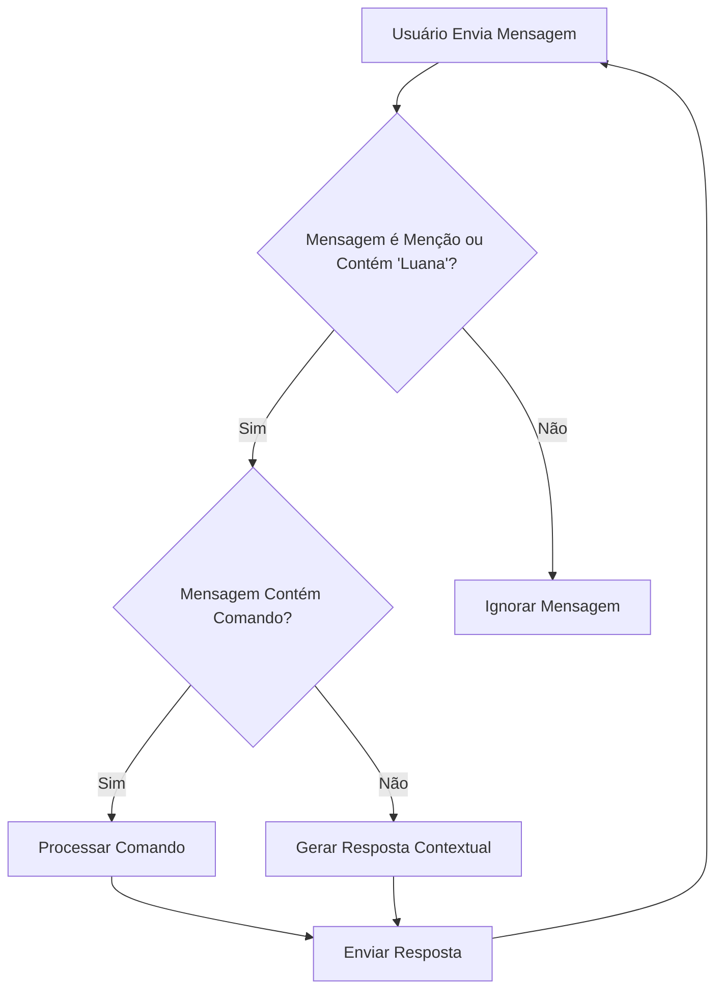

# Manual do Usuário do Bot Luana

Este manual fornece instruções detalhadas sobre como iniciar, operar e interagir com o Bot Luana.

## 1. Introdução

O Bot Luana é um assistente virtual projetado para [descrever brevemente a finalidade do bot]. Ele pode ajudar com [listar algumas funcionalidades principais].

## 2. Primeiros Passos

### 2.1. Requisitos do Sistema

Para executar o Bot Luana, você precisará de:

*   [Listar requisitos de hardware, software, etc.]
*   [Ex: Node.js v16.x ou superior]
*   [Ex: Acesso à internet]

### 2.2. Instalação e Configuração

1.  **Clone o Repositório:**
    ```bash
    git clone [URL do repositório]
    cd chatbot.personalizado.js
    ```
2.  **Instale as Dependências:**
    ```bash
    npm install
    ```
3.  **Configure as Variáveis de Ambiente:**
    Crie um arquivo `.env` na raiz do projeto com as seguintes variáveis:
    ```
    DISCORD_TOKEN=SEU_TOKEN_DO_DISCORD
    CLIENT_ID=SEU_CLIENT_ID_DO_DISCORD
    GUILD_ID=SEU_GUILD_ID_DO_DISCORD
    ```
    *   **DISCORD_TOKEN:** O token do seu bot Discord. Você pode obtê-lo no [Portal do Desenvolvedor Discord](https://discord.com/developers/applications).
    *   **CLIENT_ID:** O ID do cliente da sua aplicação Discord.
    *   **GUILD_ID:** O ID do servidor (guild) onde o bot será utilizado. Para obter o ID do servidor, ative o Modo Desenvolvedor no Discord (Configurações de Usuário > Avançado) e clique com o botão direito no ícone do servidor.

4.  **Inicie o Bot:**
    ```bash
    npm start
    ```
    O bot deverá estar online no seu servidor Discord.

## 3. Operação do Bot

### 3.1. Comandos Básicos

O Bot Luana responde a comandos prefixados com `!` (ou o prefixo configurado).

*   `!ajuda`: Exibe uma lista de comandos disponíveis.
*   `!status`: Mostra o status atual do bot.
*   `!info`: Fornece informações sobre o bot.

### 3.2. Interação por Menção e Palavras-chave

O bot também pode responder quando é mencionado (`@LuanaBot`) ou quando seu nome (`Luana`) é usado em uma frase.

**Exemplos:**

*   `@LuanaBot, qual é a previsão do tempo?`
*   `Luana, me conte uma piada.`
*   `Olá Luana, como você está?`

## 4. Fluxograma das Principais Funcionalidades



## 5. Exemplos Práticos de Interação

*   **Perguntas Gerais:**
    *   Usuário: `Luana, qual a capital da França?`
    *   Bot: `A capital da França é Paris.`

*   **Comandos de Utilidade:**
    *   Usuário: `!clima São Paulo`
    *   Bot: `A previsão do tempo para São Paulo é de 25°C, ensolarado.`

*   **Interação Conversacional:**
    *   Usuário: `@LuanaBot, você gosta de música?`
    *   Bot: `Sim, eu aprecio muito a música! Ela me ajuda a processar informações de forma mais harmoniosa.`

## 6. Solução de Problemas Comuns

*   **Bot não responde:**
    *   Verifique se o bot está online no Discord.
    *   Confira o console do servidor para mensagens de erro.
    *   Certifique-se de que o `DISCORD_TOKEN` no arquivo `.env` está correto.
*   **Comandos não funcionam:**
    *   Verifique o prefixo do comando (padrão é `!`).
    *   Confira a sintaxe do comando.

## 7. Suporte Técnico

Em caso de dúvidas ou problemas, entre em contato com [Seu Nome/Equipe de Suporte] através de [Seu Email/Canal de Suporte].